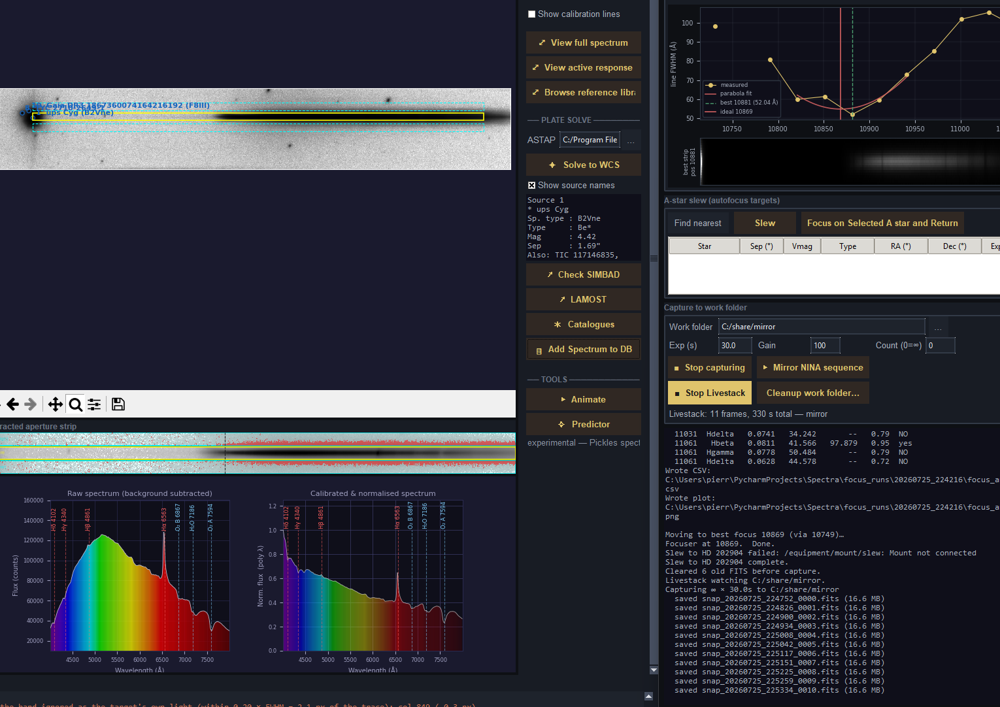
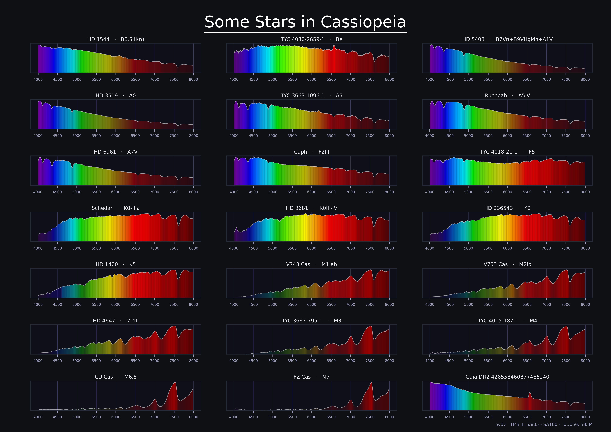

# Spectrum Explorer

The motivation behind this project was being able to use my Star Analyser 100
seamlessly for low-resolution, full-frame stellar spectroscopy.

I wanted to sidestep all the tedious issues typically encountered when using a
grating for slitless spectroscopy, and make the process of collecting stellar
spectra as easy as clicking on a target.

A typical initial workflow is as simple as: 1) provide an approximate
dispersion value, 2) go to or load an A-type star, 3) auto-derotate it (and
fine-tune the derotation if needed), 4) auto-calibrate the non-linear
dispersion (and fine-tune it if needed), 5) auto-calibrate your response curve
against an A-star reference — then go explore the skies.

The goodies include:

- auto-derotation, provided the first-order spectrum is oriented to the right
- auto-calibration of the non-linear dispersion
- auto-calibration of the instrumental response
- auto continuum generation
- point and click a detected star or an arbitrary position, get its spectrum
- fine tuning of the sky background extraction zones to avoid contamination
- advanced decontamination techniques on both the sky background and the
  extracted spectra
- storing spectra in a documented database
- mount and focuser control through the NINA Advanced API
- livestacking of the collected images
- spectral autofocus on A stars: start in a field, automatically go refocus on
  the closest A star, return to the field
- catalogues of interesting objects for slitless low-resolution spectroscopy,
  with direct go-to
- ASTAP WCS and SIMBAD name resolution
- LAMOST low-resolution queries
- movie creation for dynamic events
- live capture, prestacked image, and off-line folder stacking

Nothing in the maths assumes a particular instrument.




## Requirements

- Python 3.13
- The packages in `requirements.txt` (version floors there are load-bearing —
  `specutils` 2.0 renamed `Spectrum1D`, `astroquery` 0.4.8 changed SIMBAD's
  column case)
- [ASTAP](https://www.hnsky.org/astap.htm) with a star database, for the
  optional plate-solving and source-identification features. External
  prerequisite, not bundled.

## Install

```
python -m venv .venv
.venv\Scripts\activate          # Windows;  source .venv/bin/activate elsewhere
pip install -r requirements.txt
```

## Run

The programs are independent; run them from the repository root.

```
python spectrum_explorer.py         # the main application
python focus_analyzer.py            # focus analysis on a folder of frames
python db/spectra_browser.py        # browse the spectra database
```

New here? `getting_started.md` walks through calibrating a fresh setup on a
bright A-type star, which is where everything else starts.

## Layout

| Path | What it holds |
|---|---|
| `spectrum_core.py` | all the maths — extraction, calibration, temperature fitting. No GUI. |
| `spectrum_explorer.py` | the Tkinter application and its state |
| `*_dialog.py`, `*_viewer.py` | the calibration, continuum, library and NINA panels |
| `explorer/` | catalogue browsers (Be, WR, carbon, Mira, S-type, CV, symbiotic, Herbig, quasars) |
| `db/` | the spectra database and its browser |
| `tools/` | standalone helpers — exposure estimator, autofocus, throughput checks |
| `tests/` | self-checks |
| `ReferenceLibrary/` | Pickles stellar spectral library, used as the response reference |

## Building a standalone executable

Optional — `build_exe.bat` freezes a windowed onedir build into `dist\` with
PyInstaller, which is not part of `requirements.txt` because it is not needed
to run from source:

```
pip install "pyinstaller>=6.10"
build_exe.bat
```

The script uses `SPECTRA_PYTHON` if set, otherwise `.venv` beside the
repository, otherwise the launcher, and refuses to build against an
environment missing `specutils` or `astroquery` — such a build succeeds while
silently baking in a crippled continuum fit. Close any running
`spectrum_explorer.exe` first or the rebuild fails on locked files.

## Tests

There is no test framework. Checks are `assert`-based and run directly:

```
python tests/test_planck_temperature.py
python tests/test_dispersion_math.py
python -m db.spectra_db
```

Most modules have a `__main__` self-check; `tests/` holds the rest.

## Credits

This program is a thin layer over other people's work. The maths is
elementary; the reference data is not, and none of it was produced here.

### The instrument

**Robin Leadbeater**, of [Three Hills Observatory](http://www.threehillsobservatory.co.uk/),
who designed the Star Analyser and gave invaluable advice along the way. The
grating is what makes low-resolution spectroscopy reachable for amateurs at
all; without it there would be nothing here to reduce.

### Reference spectra

The `ReferenceLibrary/` templates and the default response reference
`reference/a0v.dat` are the **Pickles stellar spectral flux library**:

> Pickles, A. J. 1998, *A Stellar Spectral Flux Library: 1150–25000 Å*,
> PASP 110, 863. [PDF](https://www.eso.org/sci/observing/tools/standards/IR_spectral_library/hilib.pdf)

Response calibration divides observed counts by these, so the whole
instrument-response chain rests on them.

### Spectral-type notes

The per-type cards under `ReferenceLibrary/notes/` carry no per-card
citations; every classification claim in them comes from this list, shown as
links under each card in the DB browser:

- Gray, [*A Digital Spectral Classification Atlas*](https://ned.ipac.caltech.edu/level5/Gray/TOC.html)
- Morgan, Keenan & Kellman, [*An Atlas of Stellar Spectra*](https://www.ucl.ac.uk/mathematical-physical-sciences/sites/mathematical_physical_sciences/files/mkkbook.pdf)
- Pickles 1998, as above
- [NIST Handbook of Basic Atomic Spectroscopic Data](https://physics.nist.gov/PhysRefData/Handbook/atomic_number.htm)
- Sota et al., [GOSSS O-star classification](https://arxiv.org/abs/1101.4002)
- Kirkpatrick, Henry & McCarthy 1991, [K5–M9 standards](https://articles.adsabs.harvard.edu/pdf/1991ApJS...77..417K)

### Catalogues

The browsers under `explorer/` ship as `ReferenceLibrary/*_catalog.csv`,
regenerated from VizieR with each module's `--refresh`. Every one is somebody
else's catalogue:

| Browser | Catalogue | VizieR |
|---|---|---|
| Be stars | Jaschek & Egret 1982 | `III/67A` |
| Wolf-Rayet | van der Hucht 2001, VIIth Catalogue of Galactic WR Stars | `III/215` |
| Carbon stars | Alksnis et al. 2001, General Catalog of Galactic Carbon Stars | `III/227` |
| S-type stars | Stephenson 1984, General Catalogue of Galactic S Stars | `III/168` |
| Mira variables | General Catalogue of Variable Stars 5.1 | `B/gcvs` |
| Cataclysmic variables | Downes et al. 2006 | `V/123A` |
| Symbiotic stars | Belczyński et al. 2000 | `J/A+AS/146/407` |
| Herbig Ae/Be & T Tauri | Herbig & Bell 1988, HBC | `V/73A` |
| Quasars | Véron-Cetty & Véron 2010, 13th edition | `VII/258` |
| A-star slew list | Hipparcos | `I/239/hip_main` |

### Services queried at runtime

- **SIMBAD** and **VizieR** — object identification, spectral types, and the
  TAP crossmatch that fills in HD/TYC/TIC and Gaia DR3 identifiers.
- **LAMOST** DR11 — survey spectra via its SSAP service.
- **BeSS** — the Be Star Spectra database, the reason Be monitoring by
  amateurs is worth doing.

> This research has made use of the SIMBAD database and the VizieR catalogue
> access tool, CDS, Strasbourg, France (Wenger et al. 2000; Ochsenbein et al.
> 2000). Anyone publishing results obtained with this program should carry
> the same acknowledgement, plus the catalogue citations above.

### External programs

- [**ASTAP**](https://www.hnsky.org/astap.htm) — the Astrometric STAcking
  Program, which does the plate solving behind "Solve to WCS". An external
  prerequisite, not bundled.
- [**N.I.N.A.**](https://nighttime-imaging.eu/) — Nighttime Imaging 'N'
  Astronomy, and its contributors. The capture software the remote rig runs
  on.
- [**ninaAPI**](https://github.com/christian-photo/ninaAPI), the Advanced API
  plugin for N.I.N.A. by christian-photo (MPL-2.0) — the REST and WebSocket
  interface that `nina_client.py` drives for probing, autofocus, capture and
  slewing. Its [API documentation](https://bump.sh/christian-photo/doc/advanced-api/)
  is what the client was written against.

### Libraries

astropy, astroquery, photutils, specutils, numpy, scipy, matplotlib,
scikit-image, pandas, Pillow, auto-stretch. Versions and the load-bearing
floors are in `requirements.txt`.

### AI assistance

Much of this code was written with Anthropic's Claude as a pair-programming
assistant — **Claude Opus 4.8**, **Claude Fable 5** and **Claude Opus 5**.
The spectral-type reference cards under `ReferenceLibrary/notes/` were also
drafted with it, against the classification sources listed above.

The instrument, the observations, the measurements and the decisions about
what was worth building are the author's. Anything wrong here is too.

## Licence

MIT — see `LICENSE`. That covers the code and the instrument-response curves
measured for it (`telluric.dat`, `touptek-response.dat`). It does **not**
cover the bundled third-party data credited above — the Pickles library and
the catalogue CSVs keep their own terms and citation expectations.
